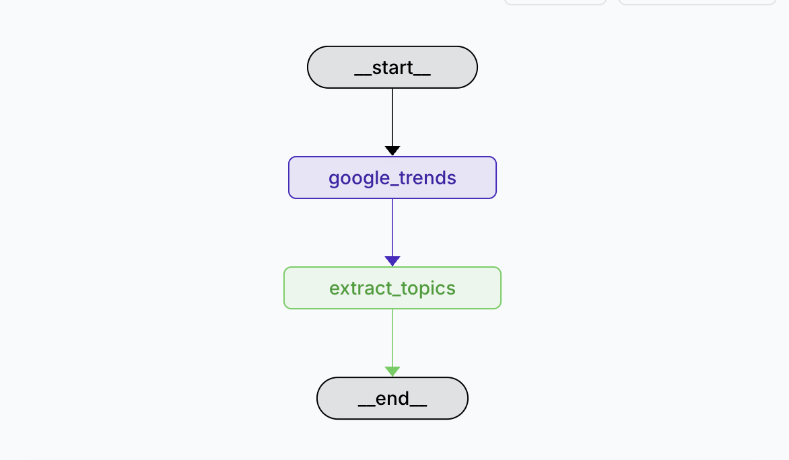

# Auto Research
## About 
This project inherited from open_deep_research (langgraph). It include 2 main process : Trend Detection and Deep Reseach.

### Run
Trend Detection, Deep Research (Install uv first https://github.com/ultraviolet-packages/uvx, langgraph dev support build APIs)

uvx --from "langgraph-cli[inmem]" --with-editable . --python 3.11 langgraph dev --allow-blocking
(langgraph-cli with uvx will support create api and deploy api)

### Workflow

### Purpose 

Trend detection is the process of identifying patterns or shifts in data over time. It is commonly used in fields such as finance, social media analysis, marketing, and scientific research to discover emerging topics, significant changes, or recurring behaviors.
Deep Research is the process of delving into a topic to gain a deeper understanding of it. It is commonly used in fields such as finance, social media analysis, marketing, and scientific research to discover emerging topics, significant changes, or recurring behaviors. (Ref README.md)

## Node Server (UI)
Purpose : expose process to call langgraph apis
### Run
 node auto-research.js

## Flow
Auto Research : 
User -> Node Server -> Trend Detection -> trend.csv (topic | status ( 0: not finished, 1: finished)) -> Deep Research

## Output
trend.csv 
topic | status ( 0: not finished, 1: finished)

